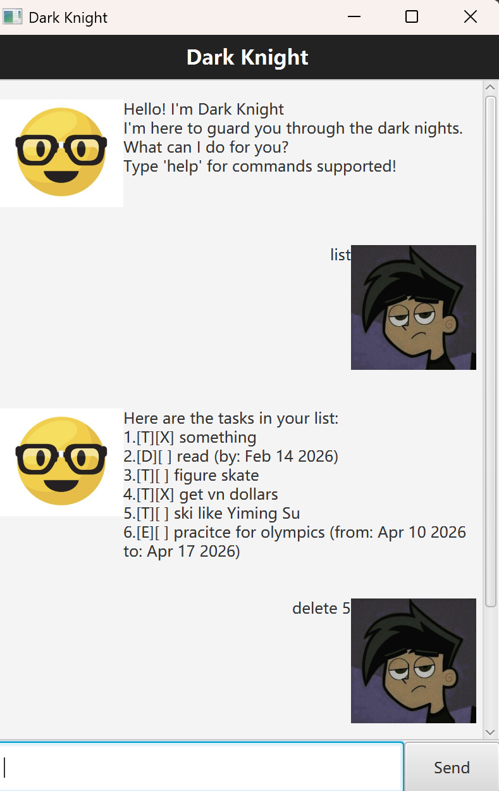

# Dark Knight

Dark Knight is a personal task manager chatbot with a JavaFX GUI. It helps you keep track of todos, deadlines, and events — and lets you archive tasks you no longer need in your active list.

## Requirements

- JDK 17
- Gradle (or use the included `gradlew` wrapper)

## Running the App

### Recommended: JAR file

Download `darkknight.jar` from the [releases](../../releases) page and run:

```bash
java -jar darkknight.jar
```

> Requires JDK 17 to be installed.

### From source (Gradle)

```bash
# Windows
gradlew run

# macOS / Linux
./gradlew run
```

### Build the JAR yourself

```bash
# Windows
gradlew shadowJar

# macOS / Linux
./gradlew shadowJar
```

The JAR will be produced at `build/libs/darkknight.jar`.

## Commands

| Command | Description |
|---|---|
| `list` | Show all tasks |
| `todo <desc>` | Add a todo task |
| `deadline <desc> /by <date>` | Add a deadline task |
| `event <desc> /from <date> /to <date>` | Add an event task |
| `mark <index>` | Mark a task as done |
| `unmark <index>` | Mark a task as not done |
| `delete <index>` | Delete a task |
| `find <keyword>` | Search tasks by keyword |
| `archive <index>` | Move a task to the archive |
| `unarchive <index>` | Move a task out of the archive |
| `archivelist` | Show all archived tasks |
| `help` | Show all available commands |
| `bye` | Exit the app |

## Date Format

Dates for `deadline` and `event` commands should be in `yyyy-MM-dd` format, e.g. `2026-03-15`.

## Setting up in VS Code

1. Install the **Extension Pack for Java** and **Gradle for Java** extensions.
2. Open the project folder in VS Code.
3. Run via the Gradle panel (elephant icon) → `application` → `run`, or use the terminal: `gradlew run`.

## Setting up in IntelliJ

1. Open IntelliJ and select `File` > `Open`, then choose the project directory.
2. Configure the project to use **JDK 17**.
3. Run via the Gradle tool window or use the terminal: `./gradlew run`.

## Data Storage

Tasks are saved automatically to `data/dark_knight.txt` and archived tasks to `data/archive.txt`.
